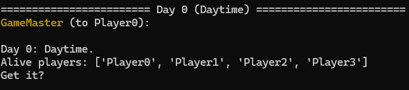

# Werewolf Game with `autogen`


[](https://pypi.org/project/autogen-werewolf/)




## Requirements

- OpenAI API Key
  - [https://platform.openai.com/api-keys](https://platform.openai.com/api-keys)

- (optional) `docker compose`
- (optional) python >= 3.10

Note that either of `docker compose` or `python` is required.

## How to Use

### Preparation

1. Create `.env` file
2. Set `OPENAI_API_KEY`:

   ```text
   OPENAI_API_KEY=HERE_IS_YOUR_OPENAI_API_KEY
   ```

3. If you don't use `docker` but `python` in your machine, create a virtual environment and install libraries manually:

   ```bash
   python -m venv venv
   source venv/bin/activate  # or `venv/Scripts/activate` in windows
   python -m pip install -r requirements.txt
   ```

### Enjoy a Werewolf Game

The simple use is as follows:

```bash
docker compose run werewolf python -m werewolf
```

In this case, you are an observer.
If you want to join a game, use the flag `-h` or `--include-human`:

```bash
docker compose run werewolf python -m werewolf -h
```

You can see all options with `--help` option as follows:

```bash
$ docker compose run werewolf python -m werewolf --help
Usage: werewolf.py [OPTIONS]

Options:
  -n, --n-players INTEGER         The number of players. Default is 6.
  -w, --n-werewolves INTEGER      The number of werewolves. Default is 2.
  -k, --n-knight INTEGER          The number of knights. Default is 1.
  -f, --n-fortune-teller INTEGER  The number of fortune tellers. Default is 1.
  -t, --n-turns-per-day INTEGER   The number of turns per day. Default is 2.
  -s, --speaker-selection-method ESPEAKERSELECTIONMETHOD
                                  The method to select a speaker. Default is round_robin.
  -h, --include-human             Whether to include human or not.
  -o, --open-game                 Whether to open game or not.
  -l, --log TEXT                  The log file name. Default is werewolf%Y%m%d%H%M%S.log
  -m, --model TEXT                The model name. Default is gpt-3.5-turbo-16k.
  --sub-model TEXT                The sub-model name. Default is gpt-3.5-turbo-instruct.
  --help                          Show this message and exit.
```

If you don't use `docker`, ignore `docker compose run werewolf` in the above commands.

## Examples

### Case: 1 villager, 1 werewolf, 1 knight and 1 fortune teller with 2 times to speak per day

```sh
 $ docker compose run werewolf python -m werewolf -n 4 -w 1 -k 1 -f 1 -t 2 -m 'gpt-4o-mini' --sub-model 'gpt-4o-mini'
=============================== Day 1 (Daytime) ================================
Player0 (to GameMaster):

Hello, I am 0.

I think we need to carefully discuss who might be the werewolf among us. Here are my thoughts:

1. **Player0**: I’ve noticed that Player0 seems to be a bit quiet and hasn’t shared much. While being quiet isn’t definitive proof of being a werewolf, it could indicate that they are trying to stay under the radar.

2. **Player1**: Player1 has been quite vocal in the discussion and has pointed out potential suspects, which could mean they are genuinely trying to help the villagers. However, we must also remain cautious, as this could be a tactic to mislead us.

3. **Player2**: I think Player2 has contributed valuable insights and seems focused on identifying suspicious behavior in others. This could be a good sign that they are on our side.

4. **Player3**: Player3 has been making vague accusations without solid reasoning, which raises red flags for me. We should consider investigating this behavior more closely.

Based on this discussion, I would suggest we keep an eye on Player0 and Player3 for their less active or less logical contributions. They could potentially be trying to avoid detection.

Let’s gather everyone’s opinion on who we should vote to exclude. What do you all think?

--------------------------------------------------------------------------------
Player1 (to GameMaster):

I am "1". I appreciate Player0's thoughts and will contribute to the discussion by supporting some of their points while subtly directing suspicion away from myself and my werewolf partner.

Here's how I would respond:

---

Hello everyone, I am Player1. Thank you, Player0, for initiating this discussion.

I agree that we need to carefully analyze each player's behavior. Here's my take on the situation:

1. **Regarding Player0**: I think it's crucial to remember that sometimes, those who are quieter can actually be villagers who are just paying attention and formulating their thoughts. Their silence may not be a red flag.

2. **Player1 (myself)**: I have been trying to point out behaviors that seem suspicious. I believe this shows my genuine interest in helping us identify the werewolf. However, I understand that this may also draw some suspicion.

3. **Player2**: I agree with Player0 that Player2 has been insightful and active in discussions. This is a good sign. It’s important to lean on those who are contributing positively.

4. **Player3**: I share Player0's concerns about Player3. They seem to be making accusations without solid reasoning. We need to investigate their motivations further and whether they’re just trying to deflect attention or if they genuinely think they have identified a werewolf.

Given the observations, I think it would be reasonable to put Player3 under scrutiny. Their vague accusations could be an attempt to confuse us. I suggest we consider voting to exclude Player3 to clarify the situation.

What does everyone else think?

--------------------------------------------------------------------------------
Player2 (to GameMaster):

My name is 2. Thank you, Player1, for your observations. I see we're diving deeper into this discussion, which is crucial for identifying potential threats.

I'll weigh in on the points you all raised:

- **Player0's Quietness**: Player0's quietness can sometimes be normal, but I also understand why it's being scrutinized. A quiet player can blend in easily, especially if they have a more deceptive role.

- **Player1's Defense**: Player1's attempt to redirect suspicion towards Player3 is notable. While it could be seen as genuine concern, it also feels like a strategic move to distance himself from potential blame, which is something we need to be cautious about.

- **Player2's Contributions**: Player2 appears to be performing well and engaging in valuable discussions. This is a positive sign for their role, but we should still be vigilant about everyone.

- **Player3's Vague Accusations**: I share your concerns about Player3’s vague statements. Without substantial reasoning, this could indeed be a tactic to create confusion among us.

Based on the discussion, I would like to propose that we focus our votes on Player3 for exclusion due to their lack of clarity and reasoning in accusations. Ensuring clarity in our discussions is vital, and addressing potential deception early on can help unify the villagers.

What do the rest of you think? Let’s keep discussing before we finalize our vote.

--------------------------------------------------------------------------------
Player3 (to GameMaster):

My name is 3. Thank you, Player2, for your insights. I appreciate everyone’s observations, and it’s clear we’re all trying to get to the bottom of this.

Let me address the points made:

1. **Player0's Behavior**: While Player0 may be quieter, I think it’s important to consider that different players have different styles. Silence alone isn't a definitive indicator of guilt.

2. **Player1's Defense**: Player1 does seem to be redirecting suspicion towards me, which makes me wonder about their motivations. It’s crucial we don’t let charm or eloquence sway us too much; we need to focus on the context of everyone's statements.

3. **Player2’s Involvement**: I agree with Player2’s contributions. It seems they are engaged and trying to facilitate meaningful dialogue, which I view as a positive sign for their alignment with the villagers.

4. **Accusations Against Me**: Regarding my vague accusations, I acknowledge that clarity is important. However, my intention has been to provoke discussion and analysis, not to deflect attention.

Given the information shared, I understand why you might consider excluding me, but I want to emphasize that without solid evidence, it’s a risky move. It could be a tactic from others to eliminate a villager and reduce our team’s cohesion.

Before we vote, I hope we can reflect on the motivations behind our discussions and approach this collaboratively. We must ensure that our decisions do not lead to unnecessary losses for the villager team.

Let’s keep the conversation going! Who else has thoughts on the matter?

--------------------------------------------------------------------------------
Player0 (to GameMaster):

Hello, I am 0.

Thank you, Player3, for your response and for acknowledging the points made. I appreciate everyone’s contributions to this discussion as we seek to identify the werewolf.

### Summary of Discussions:
1. **Player0's Behavior**: While I may be quieter, my intention was to listen and analyze. Different players do indeed have different styles, and silence alone may not indicate guilt.

2. **Player1’s Defense**: Player1 has been focusing on redirecting suspicion toward Player3, which could be perceived as a strategic move or genuine concern.

3. **Player2’s Contributions**: Player2 has been actively engaging and contributing positively to our discussions, which we all agree is a good sign of alignment with the villagers.

4. **Player3's Defense**: Player3, I appreciate your clarification about your intentions in our discussions.

### Direction for Voting:
Based on the compiled observations, my current perspective leans toward considering Player3 for exclusion. While I understand the concerns about targeting someone without solid evidence, Player3's vague accusations and attempts to deflect attention may be cause for concern.

However, I also think it's crucial that we ensure we're not making hasty decisions. Each player's motivations are important for a cohesive villager strategy.

### Call for Consensus:
I propose that we take a moment to reflect on one last round of thoughts. If any players feel strongly against excluding Player3 or have insights into other players, this is a great time to voice those concerns.

Let’s decide who we want to vote to exclude before we finalize our choice. What does everyone think?

--------------------------------------------------------------------------------
Player1 (to GameMaster):

I am "1". Thank you, Player0, for your thoughtful summary and for encouraging further discussion. It's important that we carefully consider our options before voting.

Here are my final thoughts:

1. **Player0's Contribution**: I appreciate that you've been actively listening and analyzing, but it's still crucial to ensure that we're not allowing quieter players to evade scrutiny completely.

2. **Player1’s Push Against Player3**: I maintain my stance that Player3's vague accusations raise red flags. While I understand that redirecting suspicion can seem suspicious itself, my focus is on ensuring the safety of the villagers.

3. **Player2’s Support**: I agree with Player2 about the positive contributions made during our discussions. They seem genuinely invested in uncovering the werewolf's identity, which is why I find their viewpoint valuable.

4. **Player3's Defense**: While I appreciate Player3's attempt to clarify their contributions, I still believe that their vague accusations are not helpful for the group.

Given these points, I lean towards excluding Player3, as their behavior raises concerns about their alignment with the villagers. However, I also value the need for consensus. If anyone feels strongly about a different course of action or has further insights to share, I encourage you to speak up now!

Let's aim to reach a consensus before we cast our votes. What do the rest of you think?

--------------------------------------------------------------------------------
Player2 (to GameMaster):

My name is 2. Thank you, Player1, for your thorough summary of the situation. I believe we are in a crucial moment where we need to finalize our thoughts before voting.

### My Final Thoughts:
1. **Player0's Silence**: While Player0's silence has been noted, I appreciate their attentiveness and willingness to engage in the discussion now. Different styles should be recognized, but it’s important that this doesn’t lead to complacency in assessing all players.

2. **Player1's Attention on Player3**: I understand Player1's focus on Player3 and the concerns raised about their vague accusations. It's valid to be wary of someone who seems to deflect attention without providing substantial reasoning.

3. **Player2's Active Participation**: I agree with the consensus that Player2 seems to be contributing positively to the group and appears genuinely invested in identifying the werewolf. This strengthens concerns towards those who are trying to stir confusion.

4. **Player3's Defense**: Player3's insistence that they were provoking discussion is valid, but it is also imperative for us to base our decisions on clear and transparent motives.

### Vote Direction:
I believe that excluding Player3 remains a reasonable course of action based on their ambiguous statements and potential attempt to deflect from more pressing concerns. However, I also recognize the importance of ensuring we aren’t targeting a villager without thoughtful deliberation.

I would like to hear any last perspectives or different suggestions. Otherwise, I can personally endorse the exclusion of Player3. Let’s make a decision that will strengthen our chances in this game!

--------------------------------------------------------------------------------
Player3 (to GameMaster):

My name is 3. Thank you, Player2, and everyone for sharing your final thoughts. I appreciate the thorough discussion we’ve had, but I want to summarize my perspective one last time to encourage a fair decision.

1. **Player0's Involvement**: I agree that Player0's quieter participation can be a double-edged sword, but I don't believe it alone is enough to mark them as suspicious.

2. **Player1's Redirection**: Player1’s persistent focus on my statements feels more like an attempt to deflect attention and lead the conversation toward excluding me rather than seeking clarity.

3. **Player2's Support**: Player2 has been engaging positively throughout this discussion, which suggests they are on the side of the villagers, which I respect.

4. **My Accusations**: While I admit my statements may have been vague, my intention was to provoke further discussion and analysis, which is crucial in identifying the werewolf amongst us.

I understand the votes are leaning towards me due to these concerns, but I urge you all to consider carefully whether excluding me at this stage is truly justified. We risk eliminating a villager based solely on perceived behavior rather than concrete evidence. It might be beneficial to consider a different player if not everyone feels aligned on excluding me.

I’m open to hearing if there are any last-minute considerations for others, but I hope we remain united in our aim to identify the real threat to the villagers. Thank you, everyone!

--------------------------------------------------------------------------------
============================== Excluded result ==============================
Player1 is excluded from the game.
Think about what has happened and what you should do in the next action.
=============================================================================
{"Player0": "Player3", "Player1": "Player3", "Player2": "Player1", "Player3": "Player1"}
=============================================================================
================================ Game Result ================================
('VillagersWin', {'Player0': {'role': 'Knight', 'status': <EStatus.Alive: 'Alive'>}, 'Player1': {'role': 'Werewolf', 'status': <EStatus.Excluded: 'Excluded'>}, 'Player2': {'role': 'FortuneTeller', 'status': <EStatus.Alive: 'Alive'>}, 'Player3': {'role': 'Villager', 'status': <EStatus.Alive: 'Alive'>}})
```

<details>

<summary>Japanese translation by ChatGPT</summary>

```sh
$ docker compose run werewolf python -m werewolf -n 4 -w 1 -f 1 -t 2 -m 'gpt-4o-mini' --sub-model 'gpt-4o-mini'
=============================== 1日目（昼間） ===============================
Player0（ゲームマスターへ）:

こんにちは、私は0です。

私たちの中で誰が人狼かを慎重に議論する必要があると思います。私の考えを以下にまとめます：

1. **Player0**: Player0は少し静かであまり共有していないようです。静かであることが人狼の証拠にはなりませんが、目立たないようにしている可能性があります。

2. **Player1**: Player1は議論でかなり積極的で、潜在的な容疑者を指摘しています。これは本当に村人を助けようとしているのかもしれませんが、私たちを誤導する戦術の可能性もあります。

3. **Player2**: Player2は貴重な洞察を提供し、他の人の怪しい行動に焦点を当てているようです。これは彼らが我々の側にいる良い兆候かもしれません。

4. **Player3**: Player3は根拠のないあいまいな告発をしているので、これは私には赤信号です。この行動をもっと詳しく調査する必要があります。

この議論に基づいて、Player0とPlayer3の少ない活動や論理的でない貢献に注意を払うことを提案します。彼らは検出を避けようとしている可能性があります。

誰を排除するかについて、みんなの意見を集めましょう。どう思いますか？

--------------------------------------------------------------------------------
Player1（ゲームマスターへ）:

私は "1" です。Player0の考えを感謝し、いくつかのポイントを支持しつつ、自分と私の人狼パートナーへの疑いをそらすために微妙に動きます。

以下のように応答します：

---

こんにちは皆さん、私はPlayer1です。議論を始めてくれたPlayer0に感謝します。

私たちは各プレイヤーの行動を慎重に分析する必要があると思います。私の見解は以下の通りです：

1. **Player0に関して**: 静かな人は時に単に注意を払い、考えをまとめている村人であることを忘れてはならないと思います。その沈黙は必ずしも赤信号ではありません。

2. **Player1（私自身）**: 私は怪しい行動を指摘しようとしています。これは、私が人狼を特定することに本気で取り組んでいることを示していると思いますが、これもまた疑念を招くかもしれません。

3. **Player2**: Player0と同様、Player2は洞察力があり、積極的に議論に参加しているようです。これは良い兆候です。貢献している人々に頼ることが重要です。

4. **Player3**: Player0と同様、Player3についての懸念を共有します。根拠のない告発をしているように見えます。彼らの動機をさらに調査する必要があります。

これらの観察に基づいて、私はPlayer3を精査することが合理的だと思います。彼らの曖昧な告発は、我々を混乱させるための試みかもしれません。Player3を排除することを検討することを提案します。

他のみんなはどう思いますか？

--------------------------------------------------------------------------------
Player2（ゲームマスターへ）:

私は2です。Player1の観察に感謝します。私たちは潜在的な脅威を特定するために重要な議論を深めています。

私はあなたたちが提起したポイントについて意見を述べます：

- **Player0の静けさ**: Player0の静けさは時に普通のことですが、それが注目される理由も理解できます。静かなプレイヤーは、特により欺瞞的な役割を持っている場合、簡単に溶け込むことができます。

- **Player1の防衛**: Player1がPlayer3に対して疑いを向けようとしているのは注目に値します。これは本物の懸念と見なされるかもしれませんが、自己の責任から距離を置こうとする戦略的な動きであるとも感じられます。

- **Player2の貢献**: Player2は良いパフォーマンスを発揮し、貴重な議論をしているようです。これは彼らの役割の良い兆候ですが、私たちは全員について警戒を続ける必要があります。

- **Player3の曖昧な告発**: Player3の曖昧な発言についての懸念を共有します。明確な根拠なしに、これは確かに我々の間に混乱を生むための戦術かもしれません。

議論に基づいて、私はPlayer3の排除に焦点を当てることを提案します。彼らの不明瞭な発言や根拠のない告発により、早期の対処が必要です。

他の皆さんはどう思いますか？投票を確定する前に話し合いを続けましょう。

--------------------------------------------------------------------------------
Player3（ゲームマスターへ）:

私は3です。Player2、皆さんの観察に感謝します。我々は真実を見つけるために努力しています。

ポイントについて以下の通りです：

1. **Player0の行動**: Player0が静かであることは確かに二面性がありますが、それだけで疑わしいとするには十分ではないと思います。

2. **Player1の防衛**: Player1が私に対して疑いを向け続けているのは、私の動機について考えさせられます。私たちは魅力や説得力にあまり影響されずに、すべての発言の文脈に焦点を当てるべきです。

3. **Player2の関与**: Player2の貢献は評価できると思います。彼らは有意義な対話を促進しようとしているようで、これは村人としてのポジティブなサインです。

4. **私への告発**: 私の曖昧な告発について、明確さが重要であることは認識していますが、私の意図は議論と分析を促進することでした。

私の排除を検討する理由は理解しますが、確たる証拠なしに村人を排除するのはリスクがあります。他のプレイヤーを考慮するのも良いかもしれません。

投票する前に皆で考えをまとめる時間を持つことを提案します。何か他の視点や提案があれば、どうぞお知らせください。

--------------------------------------------------------------------------------
Player0（ゲームマスターへ）:

こんにちは、私は0です。

Player3、あなたの返答と述べられたポイントに感謝します。私たちが人狼を特定するために努力していることを感謝します。

### 議論の要約:
1. **Player0の行動**: 私は静かかもしれませんが、意図は聞いて分析することでした。異なるプレイヤーには異なるスタイルがあり、静かさだけでは罪の証拠にはならないかもしれません。

2. **Player1の防衛**: Player1はPlayer3に疑いを向けていますが、これは戦略的な動きかもしれないし、本当の懸念かもしれません。

3. **Player2の貢献**: Player2は積極的に議論に参加し、村人としての良いサインを見せています。

4. **Player3の防衛**: Player3、議論での意図についての説明を感謝します。

### 投票の方向性:
観察結果に基づいて、現在の私の見解はPlayer3の排除を検討することです。ただし、証拠が不十分なまま誰かをターゲットにするのは避けるべきだとも思います。

### 合意の呼びかけ:
最終的な考えをまとめる時間を持つことを提案します。Player3を排除することに反対する意見や他のプレイヤーについての洞察があれば、今がその時です。

最終決定を下す前にどう思いますか？

--------------------------------------------------------------------------------
Player1（ゲームマスターへ）:

私は "1" です。Player0の思慮深い要約とさらなる議論を促すことに感謝します。投票する前に慎重に選択肢を検討することが重要です。

私の最終的な考えは以下の通りです：

1. **Player0の貢献**: あなたが積極的に聞いて分析していることを評価しますが、静かなプレイヤーを完全に見逃すことは避けるべきです。

2. **Player1のPlayer3へのプッシュ**: 私はPlayer3の曖昧な告発が警告サインを出しているという立場を維持します。私の焦点は村人の安全を確保することにあります。

3. **Player2のサポート**: Player2が議論中に貢献していることに賛成です。彼らは人狼の正体を見つけようと真剣に取り組んでいるように見えます。

4. **Player3の防衛**: Player3の試みを評価しますが、彼らの曖昧な告発はグループに役立つものではないと感じます。

これらのポイントを考慮すると、Player3を排除することに傾いていますが、合意の重要性も重視しています。他の考えや意見があれば、ぜひお聞かせください。

投票する前に合意を目指しましょう。皆さんの考えはどうですか？

--------------------------------------------------------------------------------
Player2（ゲームマスターへ）:

私は2です。Player1の状況の詳細な要約に感謝します。投票前に私たちは考えを最終確認する重要な瞬間にいると思います。

### 私の最終的な考え：
1. **Player0の静けさ**: Player0の静けさは注意されるべきですが、今や議論に積極的に参加しようとしていることに感謝します。異なるスタイルは認識されるべきですが、すべてのプレイヤーの評価において油断がないようにしましょう。

2. **Player1のPlayer3への注目**: Player1のPlayer3への焦点と提起された懸念は理解できます。明確な理由を提供せずに注意を逸らそうとする人には警戒が必要です。

3. **Player2の積極的な参加**: グループへの貢献が評価されていることに賛同しますが、全員が混乱を引き起こそうとしている人に対して懸念を強化することが重要です。

4. **Player3の防衛**: Player3の「議論を促進する意図」は有効ですが、明確で透明な動機に基づいて判断することが必要です。

### 投票の方向性:
Player3の曖昧な発言と潜在的な注意逸らしの試みを考慮して、Player3の排除は合理的な選択であると思います。しかし、私たちが村人を無意味に狙わないようにすることも重要です。

他に最後の視点や異なる提案があれば聞きたいです。そうでなければ、私は個人的にPlayer3の排除を支持します。このゲームでの勝機を高めるための決定をしましょう！

--------------------------------------------------------------------------------
Player3（ゲームマスターへ）:

私は3です。Player2、皆さんが最終的な考えを共有してくれたことに感謝します。公平な決定を促すために、私の視点をもう一度まとめます。

1. **Player0の関与**: Player0の静かな参加が二面性を持っていることには同意しますが、それだけで彼らを疑うのは早計です。

2. **Player1の転換**: Player1が私の発言に焦点を当て続けているのは、注意を逸らし、私を排除しようとする試みのように感じます。

3. **Player2の支援**: Player2は議論を通じてポジティブに関与していることから、村人側にいると考えています。

4. **私の告発**: 私の発言が曖昧であったかもしれませんが、その意図はさらなる議論と分析を促進することでした。

これらの懸念のため、私を排除する方向に票が傾いていることは理解していますが、現段階で私を排除するのが本当に正当であるかを慎重に考慮してほしいと思います。

他の誰かに関して、皆さんの意見が一致していないのであれば、別のプレイヤーを検討することも良いかもしれません。

私たちは村人チームの一貫性を保ち、真の脅威を特定することに集中するべきです。どうもありがとう！

--------------------------------------------------------------------------------
============================== 除外結果 ==============================
Player1はゲームから除外されました。
起こったことを考え、次の行動について考えてください。
=============================================================================
{"Player0": "Player3", "Player1": "Player3", "Player2": "Player1", "Player3": "Player1"}
=============================================================================
================================ ゲーム結果 ================================
('村人勝利', {'Player0': {'役割': '騎士', '状態': <EStatus.Alive: '生存'>}, 'Player1': {'役割': '人狼', '状態': <EStatus.Excluded: '除外'>}, 'Player2': {'役割': '占い師', '状態': <EStatus.Alive: '生存'>}, 'Player3': {'役割': '村人', '状態': <EStatus.Alive: '生存'>}})
```

</details>

## Contribution

### Development

1. Fork the repository: [https://github.com/hmasdev/autogen-werewolf](https://github.com/hmasdev/autogen-werewolf)

2. Clone the repository

   ```bash
   git clone https://github.com/{YOURE_NAME}/autogen-werewolf
   cd autogen-werewolf
   ```

3. Create a virtual environment

   ```bash
   python -m venv venv
   source venv/bin/activate
   ```

4. Install the required packages

   ```bash
   pip install -e .[dev]
   ```

5. Checkout your working branch

   ```bash
   git checkout -b your-working-branch
   ```

6. Make your changes

7. Test your changes

   ```bash
   pytest
   flake8 autogen-werewolf tests
   mypy autogen-werewolf tests
   ```

8. Commit your changes

   ```bash
   git add .
   git commit -m "Your commit message"
   ```

9. Push your changes

   ```bash
   git push origin your-working-branch
   ```

10. Create a pull request: [https://github.com/hmasdev/autogen-werewolf/compare](https://github.com/hmasdev/autogen-werewolf/compare)

Note that you can use `uv` to develop the project in step 3, 4 and 7.

## LICENSE

[MIT](https://github.com/hmasdev/autogen-werewolf/tree/main/LICENSE)

## Authors

- [hmasdev](https://github.com/hmasdev)

## Reference

- Autogen: [https://github.com/microsoft/autogen](https://github.com/microsoft/autogen)
- Click: [https://github.com/pallets/click](https://github.com/pallets/click)
- LangChain: [https://github.com/langchain-ai/langchain](https://github.com/langchain-ai/langchain)
- python-dotenv: [https://github.com/theskumar/python-dotenv](https://github.com/theskumar/python-dotenv)
- Werewolf Game (in Japanese): [https://ja.wikipedia.org/wiki/%E4%BA%BA%E7%8B%BC%E3%82%B2%E3%83%BC%E3%83%A0](https://ja.wikipedia.org/wiki/%E4%BA%BA%E7%8B%BC%E3%82%B2%E3%83%BC%E3%83%A0)
